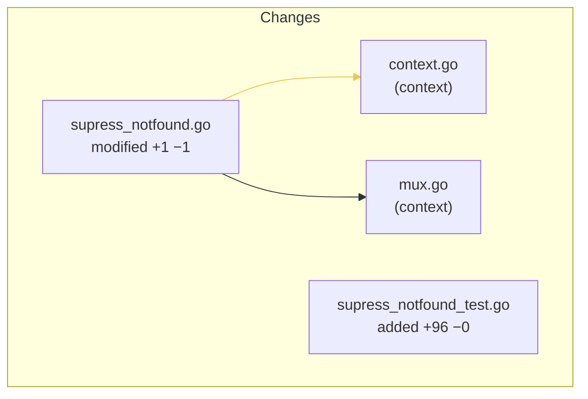

Context trimmed: 0 unchanged elements and 1 unchanged relationships omitted.

```mermaid
flowchart LR
%% tld-scene repo=1 key=3e67eab4c69557785c478e09d23be6b84e5ed3f808cc3985ebf85424ca01d0ae
%% impact files=2 added=97 removed=1 complete=true basis=net_tree binary=0 affected=2 neighbours=2 authored=0 containers=0 radius=1

subgraph view_neg1["Changes"]
  direction LR
  el_neg1_neg450670847["supress_notfound.go<br/>modified +1 −1"]
  el_neg1_neg1242573642["supress_notfound_test.go<br/>added +96 −0"]
  el_neg1_neg30531451["context.go<br/>(context)"]
  el_neg1_neg1104064361["mux.go<br/>(context)"]
  el_neg1_neg450670847 --> el_neg1_neg30531451
  el_neg1_neg450670847 --> el_neg1_neg1104064361
end

linkStyle 0 stroke:#ecc94b
```
